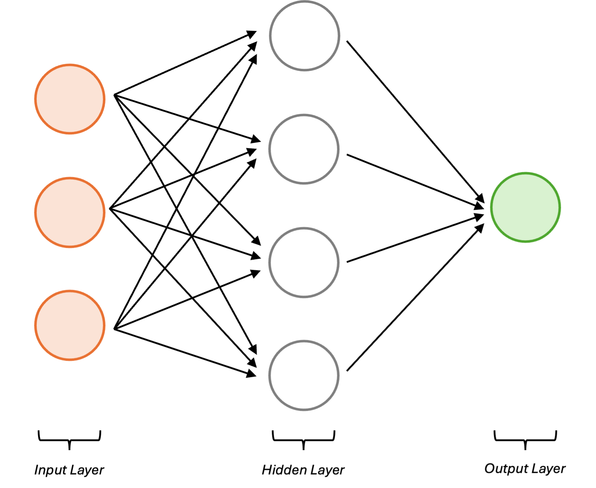
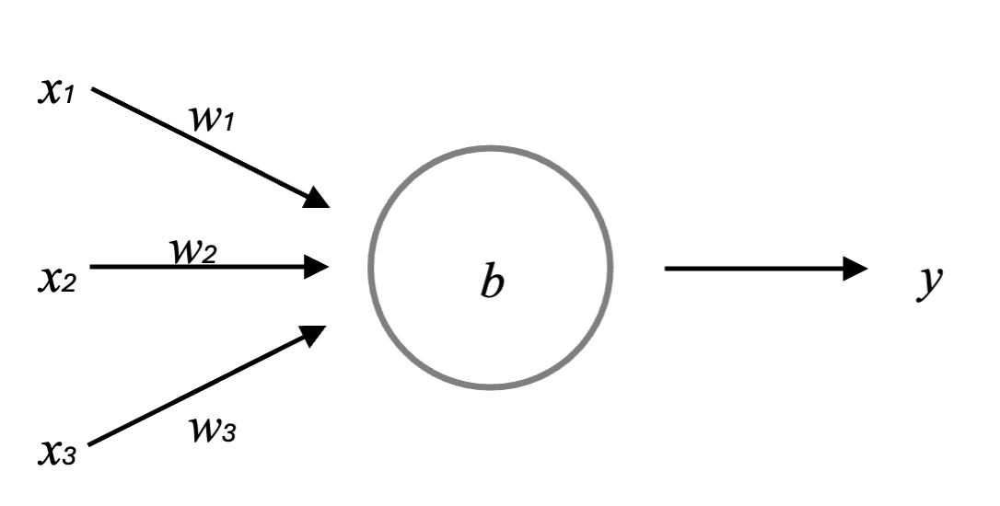

```{r setup, include=FALSE}
knitr::opts_chunk$set(echo = TRUE)
```

```{r, echo=FALSE}
# Load data from global environment :
#load("fulldata.RData")

# To increase the speed of the rendering, we only run the "CarInsurance" code separately,
# and use the variables stored in the global environment.
# This also allows to reduce the size of the Rmd file by moving as much code as possible to the R file.
# To be able to access the variables, the markdown code should be run in the console :
#
# rmarkdown::render("CarInsuranceReport.Rmd")
#
# The other option is to include the script in this file by removing the comment of the line below :
#
# source("CarInsurance.R")
#
```

\begin{center}
\vspace*{\fill}

\includegraphics[width=0.2\textwidth]{images/carinsurancereport-cover.png}

\vspace*{\fill}
\end{center}

\newpage

\tableofcontents

\newpage

# 1. Introduction

The insurance industry serves as a critical safety net in today's society, offering a mechanism for individuals and businesses to manage risk. At its core, insurance is a contractual agreement between an insurer and a policyholder, where the insurer provides financial protection against certain risks in exchange for regular payments known as premiums. This mitigates the financial impact of unforeseen events, such as accidents, natural disasters, or health issues, ensuring that policyholders are not left vulnerable in times of need.

## 1.1 Understanding Car Insurance

Car insurance specifically addresses risks related to vehicle ownership and operation. It provides coverage for damages to the vehicle, bodily injury to the driver or passengers, and third-party liabilities that may arise from motor vehicle accidents. Policies can vary widely, including comprehensive coverage, which protects against theft or damage outside of collisions, and liability coverage that pays for damages to other parties in the event of an accident caused by the policyholder.

## 1.2 How Insurance Works

The fundamental principle of insurance is risk pooling. By collecting premiums from multiple policyholders, insurance companies can create a reserve fund to cover claims when they arise. The likelihood of individual claims is statistically evaluated, allowing insurers to set premium rates that reflect the risk associated with different policyholders. This system is crucial for maintaining financial stability within the insurance sector, enabling insurers to meet their commitments even in challenging circumstances.

## 1.3 Impact of the Digital Age

In recent years, the insurance industry has experienced significant transformation due to the digital age. Technologies such as mobile applications, online platforms, and telematics have revolutionized how insurance is marketed, sold, and managed. Customers now enjoy convenience in purchasing policies, accessing services, and making claims through user-friendly digital interfaces.

## 1.4 The Role of Artificial Intelligence

Among the most influential advancements in the insurance sector is the integration of artificial intelligence (AI) [1]. AI-enhanced systems can analyze vast amounts of data in real-time, improving underwriting processes, claim assessments, and customer service interactions. In car insurance, AI algorithms can evaluate driving behavior through telematics devices, tailoring coverage and pricing based on actual risk rather than historical averages. This not only leads to personalized premium rates but also encourages safer driving habits among policyholders.

Furthermore, AI enables predictive analytics, which empowers insurance companies to anticipate future risks and trends. By leveraging data from various sources, including social media, weather patterns, and historical claims, insurers can develop cost prediction models that enhance financial forecasting and optimize reserve allocation. This transformative approach helps insurance companies remain competitive while also improving customer satisfaction through tailored services.

\newpage

# 2. Objective

This document outlines my final capstone project for the HarvardX Data Science Professional Certificate. Throughout the course, I have developed essential skills in data analysis, statistical modeling, and machine learning techniques, all of which can be found in the accompanying Data Science book [2]. This project aims to apply these skills within the insurance industry, focusing specifically on predicting insurance costs.

The primary goal of this report is to leverage machine learning tools to forecast the costs associated with car insurance policies. By integrating theoretical knowledge with practical applications, I aim to demonstrate my proficiency and understanding acquired during the course. Utilizing advanced algorithms and data analytics, this project aspires to provide insightful predictions, taking into account various risk factors that may affect the costs faced by policyholders.

## 2.1 Cost Prediction

Predicting insurance costs is pivotal for both insurers and policyholders, as these costs can vary significantly based on multiple factors, including the type of coverage selected and the individual’s claims history. For instance, comprehensive coverage often incurs higher premiums compared to basic liability coverage due to its broader scope of protection. This section will employ machine learning algorithms to forecast insurance costs by analyzing several contributing factors that align with policyholders’ unique risk profiles.

## 2.2 Data Limitations

While striving to create a robust predictive model for insurance costs, this project faces certain data limitations. The dataset provides limited demographic and policy-related information, and it encompasses only a timeframe of 4 to 5 years of data. These constraints may affect the precision of the cost predictions and the overall robustness of the model. Nevertheless, the goal is to maximize the utilization of available data, concentrating on the most relevant features to derive meaningful insights into insurance costs and risk assessment.

\newpage

# 3. Dataset

## 3.1 The Rarity of Open Datasets in the Insurance Sector

Open datasets in the insurance industry are relatively scarce due to the highly sensitive nature of the information they contain. Insurance companies manage vast amounts of personal and financial data, which, if exposed, could compromise individual privacy and lead to significant legal consequences. The insurance sector is also heavily regulated, requiring strict compliance with data protection laws, such as GDPR in Europe. This regulatory framework makes insurers particularly cautious about sharing their data publicly.

Furthermore, insurance data is often perceived as a competitive advantage. Companies are reluctant to disclose their datasets, fearing that it could reveal proprietary algorithms and models designed for specific underwriting processes and claims assessments. As a result, high-quality open datasets that could significantly contribute to academic and research endeavours are limited.

## 3.2 Selected Dataset

Given these challenges, the dataset I have selected for analysis is exceptional due to its comprehensive nature and applicability in evaluating AI-driven cost prediction models in the car insurance sector. This dataset originates from a **Spanish insurance company that specializes in non-life insurance**.

While the dataset does include some policyholder demographic information, it is notably limited in scope. However, it features a variety of other important variables essential for a thorough analysis of risks, premiums, and factors influencing claims. This includes details related to the vehicles insured, historical claims data, and additional criteria that can impact risk assessment.

Accessing such a dataset is valuable as it allows for the exploration of correlations and trends relevant to AI-driven cost predictors. The dataset is publicly available at the Mendeley Data website [3], but to ensure its continued accessibility, I have also copied the dataset to my GitHub repository [4]. This redundancy will ensure that the dataset remains available even if the original website removes it. This data is an important resource for understanding the complexities of car insurance and enables the application of predictive analytics in this domain. Through this analysis, I aim to uncover insights that will enhance the development and implementation of AI-driven cost models in insurance.

## 3.3 Files

The dataset is organized as three different files : a spreadsheet and two comma-separated value files.

```{r, echo=FALSE}
dataset_files <- data.frame(
  icons = c(
    "\\includegraphics[width=0.5cm]{images/file-excel.png}",
    "\\includegraphics[width=0.5cm]{images/file-csv.png}",
    "\\includegraphics[width=0.5cm]{images/file-csv.png}"
  ),
  filename = c(
    "Descriptive of the variables.xlsx",
    "Motor vehicle insurance data.csv",
    "Sample type claim.csv"
  ),
  stringsAsFactors = FALSE
)

kbl(dataset_files, format = "latex", booktabs = TRUE, linesep = "", escape = FALSE, col.names = c("", "Dataset Files")) %>%
  kable_styling(font_size = 9, latex_options = c("hold_position"))
```

The spreadsheet **"Descriptive of the variables.xlsx"** contains a list of the variables and their description.

The main dataset is in the "Motor vehicle insurance data.csv" file, comprising **105,555 observations** across **30 variables**. Each row within the dataset corresponds to an individual insurance policy recorded over a specific year, covering the period from **November 2015 to December 2018**.

The last file **"sample type claim.csv"** contains a list of different claims. It has 7,366 observations or claims while the main dataset contains 19,646 observations with at least one claim.
As its name suggests, it is a sample and won't be useful for the rest of the analysis.

## 3.4 Structure

The table below is based on the "Descriptive of the variables" spreadsheet, indicating the different variables present in the dataset.

```{r, echo=FALSE}
kbl(variables, format = "latex", booktabs = TRUE, linesep = "", format.args = list(big.mark = ",")) %>%
  kable_styling(font_size = 9, latex_options = c("hold_position")) %>%
  column_spec(2, width = "12cm")
```

This table indicates that we have very limited information about the policyholder (or driver). Specifically, we only possess details regarding their age, the duration of their driving licence, the type of car they are driving, and their geographic area. However, we lack critical information such as gender, occupation, and income. In contrast, we have more comprehensive details about the car itself, including its power, number of doors, length, and weight, but we do not have the make or model. Additionally, we have some information related to the insurance policy.

## 3.5 Background

Between 2015 and 2018, the number of car accidents in Spain witnessed a notable decrease, reflecting the effectiveness of various road safety measures and legislative changes implemented during this period. Reports indicate that Spain achieved a 27% reduction in fatalities, contributing to a broader EU target of halving fatal road accident victims by 2020.

This improvement can be attributed to several factors, including enhancements in traffic laws, public awareness campaigns, and infrastructure investments, as outlined in the table below. For further insights into these trends and statistics, refer to the following sources: EU Target Report (iRAP) [3] and the EuroRAP National Road Safety Profile - Spain [4].

The following is a list of significant events and laws in Spain during the 2010s that may have contributed to a reduction in car accidents :

```{r, echo=FALSE}
road_events <- data.frame(
  Year = c(2011, 2014, 2014, 2016, 2016, 2019, 2019),
  Event_Law = c("Traffic Act Reforms",
                "Introduction of the 'Zero Alcohol' Law",
                "Raúl's Law",
                "Compulsory Use of Seat Belts",
                "New Road Safety Campaigns",
                "Update of Traffic Regulations (Royal Decree 1428/2003)",
                "Reduction of Speed Limits in Urban Areas"),
  Description = c("Enhanced penalties for driving infractions, focusing on speeding, alcohol, and drugs.",
                  "Aimed at reducing drunk driving, particularly for novice drivers and underage individuals.",
                  "Increased penalties for hit-and-run offenses and harsher consequences for reckless driving.",
                  "Stricter enforcement and educational campaigns to ensure seat belt use for all passengers.",
                  "Initiatives focusing on pedestrian safety and education about safe driving practices.",
                  "Included measures to improve road safety and enforcement of traffic laws.",
                  "Lowered speed limits in city areas, aimed at reducing accidents involving pedestrians.")
)
kbl(road_events, format = "latex", booktabs = TRUE, linesep = "") %>%
  kable_styling(font_size = 9, latex_options = c("hold_position")) %>%
  column_spec(2, width = "5cm") %>%
  column_spec(3, width = "10cm")
```

\newpage

# 4. Data Transformation

To proceed with our analysis effectively, it is crucial to transform our dataset to enhance its usability. The steps involved in this transformation are outlined below:

## 4.1 Formatting Dates

First, it is essential to ensure that all date fields in our dataset are correctly formatted as date objects. In R, this allows for easier manipulation and calculations involving dates, such as comparisons or date arithmetic. This step will enable us to:

- Perform date calculations more intuitively.
- Filter or subset data based on date criteria.
- Visualize trends over time more effectively.

## 4.2 Removing Redundant Columns

Next, we will remove the Date_next_renewal column from our dataset. This column contains dates that are exactly one year after the Date_last_renewal. As this information is redundant, keeping it does not add any value to our analysis.

## 4.3 Extracting the Current Year

We will use the year derived from the Date_last_renewal column to establish the current year for our analysis. This approach provides:

- A consistent reference point for evaluating policy conditions and year-over-year changes.
- A clearer framework for understanding the lifecycle of each policy.

## 4.4 Revising Claims Historical Data

N_claims_history and R_Claims_history are two values related to the number of claims filed throughout the **entire duration** of the insurance policy.

As we want to see the evolution year by year, we want to re calculate these values to use the number of claims filed **before** the current year.

Retaining only past claims ensures that our analysis focuses on historical performance rather than including current, ongoing claims. This filtering allows us to:

- Better assess historical risk and claim trends without current influences.
- Generate more accurate forecasts based on past behaviours.

\newpage

During the calculations, we identified some data inconsistencies. For example :

- ID 12 shows 12 total claims raised, but only 8 in the history column,
- ID 18 has an R_Claims_history of 0.36, which suggests 9 claims over 25 years, rather than 7.2 over 20 years :

```{r, echo=FALSE}
kable(data_problem_sample, format = "latex", booktabs = TRUE, linesep = "", format.args = list(big.mark = ",")) %>%
  kable_styling(font_size = 9, latex_options = c("hold_position")) %>%
  column_spec(2:ncol(data_problem_sample), width = "2cm")
```

## 4.5 Split the data

Lastly, to effectively analyse the insurance claims data related to car accidents from 2015 to 2018, we will split the dataset into training and testing subsets.

We will retain all data up until August 2018 for the training set, allowing us to develop and optimize an algorithm designed to predict insurance costs.

The remaining data from September 2018 onwards will be designated as the test set.

This approach ensures that approximately 90% of the data is used for training, while the test set comprises around 10%.

```{r, eval=FALSE}
# Define the cutoff date
cutoff_date <- as.Date("2018-09-01")

# Create train_set
train_set <- insurance_data %>%
  filter(Date_last_renewal < cutoff_date)

# and test_set
test_set <- insurance_data %>%
  filter(Date_last_renewal >= cutoff_date)
```

For subsequent analyses and predictions, we will utilize the training set.

\newpage

# 5. Exploratory Data Analysis

## 5.1 Distribution

### 5.1.1 Timeline

Understanding the evolution of our insurance portfolio is crucial for analyzing the number of different policies per year, alongside the total number of policies across the years. This timeline enables us to grasp trends, identify peak activity periods, and assess changes in business dynamics over time.

The following table summarizes the data regarding the number of policies for each year, highlighting key trends and variations :

```{r, echo=FALSE}
kable(insurance_year, format = "latex", booktabs = TRUE, linesep = "", format.args = list(big.mark = ",")) %>%
  kable_styling(font_size = 9, latex_options = c("hold_position")) %>%
  column_spec(1, width = "0.5cm") %>%
  column_spec(2:ncol(insurance_year), width = "2cm")
```

In 2015, we recorded only **4,559** policies, as the data starts from November of that year. In **2016**, the number of unique policies rose to **31,428**. This growth continued in **2017**, reaching **33,753** unique policies, and further increased in **2018** to a total of **25,621** unique IDs in only 8 months.

```{r, echo=FALSE, fig.align="center", fig.cap = "Number of policies (Total and with claims) over the years", fig.width=6, fig.height=3}
plot_grid(
  timeline_policies_claims,
  timeline_cost,
  ncol = 2, align = 'hv'
)
```

The two plots above indicate that there were few policies and low costs in 2015, as data collection began in November. From 2016 to 2018, the number of policies remained stable; however, there were fewer policies with claims and a decline in total claims in 2017 compared to 2016, resulting in lower costs over the years. Notably, the ratio of claims to policies with claims decreased annually, suggesting that not only were there fewer policies with claims, but also that the average number of claims per policy for those that did have claims diminished as well.

\newpage

The table below shows the new and terminating policies per year, as well as the related claim proportions :

```{r, echo=FALSE}
kable(insurance_mv, format = "latex", booktabs = TRUE, linesep = "", format.args = list(big.mark = ",")) %>%
  kable_styling(font_size = 9, latex_options = c("hold_position")) %>%
  column_spec(1, width = "0.5cm") %>%
  column_spec(2:ncol(insurance_mv), width = "2.2cm")
```

This data provides a comprehensive overview of policy trends over the four-year period from 2015 to 2018, detailing total policies, new and terminating policies, and their associated claims proportions. Notably, much of the data originates from pre-existing policies (created before 2015) that were likely added later to the dataset.

```{r, echo=FALSE, warning=FALSE, fig.align="center", fig.cap = "Distributions of Power and Value Vehicle", fig.width=6, fig.height=3}
plot_grid(
  timeline_nb_policies,
  timeline_r_policies_claim,
  ncol = 2, align = 'hv'
)
```

In 2015, the breakdown showed 4,559 total policies, comprised of 1,112 new policies introduced and 756 terminating policies. Approximately 30% of all policies had claims, indicating a substantial level of risk among these policies. Particularly noteworthy is that 41.7% of new policies filed claims, reflecting a high incidence of claims within these newly established contracts. In contrast, only 0.3% of terminating policies had claims, suggesting a much lower risk level as these contracts concluded.

As the years progressed, the total number of policies sharply increased, peaking at 35,815 in 2018. However, the proportion of policies with claims demonstrated a downward trend, lowering to 9.5% by 2018. This decline may indicate improvements in risk management, underwriting criteria, or policyholder behaviour over time. For new policies, the proportion of claims also saw a decrease to 18.2%, which points to either a change in the nature of the new policies or a more cautious approach in their issuance. Conversely, termination policies consistently reported low claims rates, peaking at 4.4% in 2016 but remaining low overall, suggesting that most terminating policies were relatively risk-free by the time they concluded.

\newpage

### 5.1.2 Vehicle

We have some additional variables related to the vehicles :

```{r, echo=FALSE}
car_summary_1 %>%
  kbl(format = "latex", booktabs = TRUE, linesep = "", format.args = list(big.mark = ",")) %>%
  kable_styling(font_size = 9, latex_options = c("hold_position"))

car_summary_2 %>%
  kbl(format = "latex", booktabs = TRUE, linesep = "", format.args = list(big.mark = ",")) %>%
  kable_styling(font_size = 9, latex_options = c("hold_position"))
```

The number of doors on the cars ranges from 0 to 6, with a median of 5 doors and an average of approximately 4.07, suggesting that most vehicles are likely standard sedans or hatchbacks. The power output varies significantly, from a minimum of 0 to a maximum of 580 horsepower, with a mean of 92.68. This indicates a diverse range of vehicle types, from compact cars to high-performance models. The cylinder capacity ranges from 49 to 7480 cubic centimeters, with an average of 1618 cm³, reflecting varying engine sizes suited to different performance needs and fuel types.

```{r, echo=FALSE, warning=FALSE, fig.align="center", fig.cap = "Distributions of Power and Value Vehicle", fig.width=6, fig.height=2}
plot_grid(
  distribution_power,
  distribution_value,
  ncol = 2, align = 'hv'
)
```

When examining fuel types, a significant majority of cars in the dataset use diesel (D), with 64,998 instances, while 38,793 vehicles are powered by petrol (P), and 1,764 entries have missing data for fuel type. The length of the vehicles spans from 1.978 to 8.218 meters, with a mean length of approximately 4.25, indicating a prevalence of standard-sized cars. The weight ranges from 43 to 7300 kilograms, with a mean of 1191 kg, suggesting that the dataset includes both lightweight cars and heavier vehicles, potentially such as vans or trucks.

In terms of year of matriculation, the cars range from models dated 1950 to 2018, with a mean and median year around 2005, indicating that the dataset covers both classic and more modern vehicles. Finally, there is a wide variance in the value of the vehicles, with a minimum of approximately 270.5 and a maximum of around 220,675.8. The average vehicle value is approximately 18,413.7, reflecting a mixture of economical and luxury cars in the collection.

### 5.1.3 Policy Holder

Here is a summary of the variables associated with the policy holders :

```{r, echo=FALSE}
driver_summary %>%
  kbl(format = "latex", booktabs = TRUE, linesep = "", format.args = list(big.mark = ",")) %>%
  kable_styling(font_size = 9, latex_options = c("hold_position"))
```

The date of birth ranges from April 5, 1918 to October 11, 2000, indicating that the drivers cover a wide span of ages, with most being born between 1960 and 1980. This suggests that the dataset includes both older and relatively newer drivers, allowing for an analysis of trends across different age groups.

The date of driving license acquisition varies from October 1, 1942 to November 26, 2018, indicating that some drivers have held their licenses for many decades, while others are more recent license holders.

```{r, echo=FALSE, warning=FALSE, fig.align="center", fig.cap = "Distributions of Ages and Driving ages", fig.width=6, fig.height=2}
plot_grid(
  distribution_age,
  distribution_licence_age,
  ncol = 2, align = 'hv'
)
```

Note that while policy holder details and demographic may have been removed to comply with GDPR and obvious privacy reasons, the combination date of birth - date of driving licence could potentially help identify someone. While this is not the purpose of this paper, a study found that it's possible to identify a person based only on gender, date of birth and postcode [5].

Seniority ranges from 1 to 40 years, with an average of about 6.7 years. This suggests a mix of novice and experienced policyholders, although the median seniority of 4 years indicates that many drivers are relatively new to their insurance policies.

The area variable is binary, indicating whether the drivers are located in urban (1) or rural (0) settings. Approximately 27.39% of drivers reside in urban areas, highlighting a predominance of rural drivers in the dataset. 

Lastly, the second driver variable shows that only about 12.37% of the drivers have a secondary driver listed, indicating that most operate their vehicle independently.

\newpage

### 5.1.4 Policy Details

Now the policy details :

```{r, echo=FALSE}
policy_summary_1 %>%
  kbl(format = "latex", booktabs = TRUE, linesep = "", format.args = list(big.mark = ",")) %>%
  kable_styling(font_size = 9, latex_options = c("hold_position"))
```

The policy IDs range from 1 to 53,502, indicating a substantial dataset of individual insurance policies. The contract start dates span from October 25, 1980, to November 30, 2018, with a mean date around June 26, 2014, suggesting a blend of older and more recent policies. The last renewal dates have a similar range, with the earliest being November 2, 2015, and the latest also being November 30, 2018, implying all policies were active at some point between 2015 and 2018. The Distribution_channel indicates that more policies were contracted through agents (0) than through brokers (1).

```{r, echo=FALSE}
policy_summary_2 %>%
  kbl(format = "latex", booktabs = TRUE, linesep = "", format.args = list(big.mark = ",")) %>%
  kable_styling(font_size = 9, latex_options = c("hold_position"))
```

The Policies_in_force column shows a range from 1 to 17, with a mean of approximately 1.44, indicating that while most policies have a single policy in force, a small number of policies possess multiple active accounts. This suggests that policyholders typically hold one policy.

The Max_policies column ranges from 1 to 17 as well, with an average of around 1.83 policies per holder, suggesting some customers maintain multiple policies, potentially enhancing coverage or benefits. However, the Max_products column, which varies from 1 to 4, with an average of 1.07, indicates that most policies involve only a single product, implying limited diversification in policy offerings per holder.

The Lapse column shows a minimum value of 0 and a maximum of 7, with a mean of approximately 0.23, indicating that while lapsing (a policy termination due to non-payment or inactivity) does occur, it is not widespread across the dataset. Most policies appear stable. The Date_lapse provides a timeline of lapses, ranging from November 2, 2015, to June 1, 2019, with the median lapse date falling on August 25, 2017. The significant number of NA values (61,287) suggests that many policies may lack lapse data, possibly indicating they have remained active or that the lapse information was not recorded.

Overall, the data indicates a predominance of single policies held by customers, with some retaining multiple policies for additional coverage, while lapsing appears to be limited but varied.

\newpage

```{r, echo=FALSE}
policy_summary_3 %>%
  kbl(format = "latex", booktabs = TRUE, linesep = "", format.args = list(big.mark = ",")) %>%
  kable_styling(font_size = 9, latex_options = c("hold_position"))
```

The Payment column signifies the last payment method used for the reference policy: 1 indicates a half-yearly administrative process, while 0 represents an annual payment method. The mean value of approximately 0.32 suggests that a notable portion of policies utilizes the half-yearly option, although many still adhere to the traditional annual payment method.

The Premium column ranges from a minimum of 40.14 to a maximum of 2,993.34, with a mean premium of around 316.33. This wide spread of premium amounts reflects variations based on policy type, coverage levels, and risk assessments. The median premium of 292.97 indicates that half of the policies have premiums below this amount, suggesting that many policies are likely in the low- to mid-tier range in terms of coverage.

The Type_risk column classifies vehicles insured under the policies, with 1 for motorbikes, 2 for vans, 3 for passenger cars, and 4 for agricultural vehicles. The mean value of approximately 2.72 and a median of 3.00 indicate that the majority of policies are associated with passenger cars, with a balanced distribution among the different vehicle types.

Overall, the data reflects a diverse portfolio of insurance policies with varying premium rates influenced by risk categories, as well as a significant number of policies opting for half-yearly payment methods.

```{r, echo=FALSE}
policy_summary_4 %>%
  kbl(format = "latex", booktabs = TRUE, linesep = "", format.args = list(big.mark = ",")) %>%
  kable_styling(font_size = 9, latex_options = c("hold_position"))
```

The Cost_claims_year column shows a wide range in claim costs, from a minimum of 0.0 to a maximum of 260,853.2, with a mean cost of approximately 169.1. Most policies report zero costs annually, as reflected by the minimum and median values being 0.0, indicating that a significant number of policies did not incur claims in the year analyzed.

The N_claims_year column, which counts the number of claims made within the year, also demonstrates limited activity, with most entries recording 0 claims. The average number of claims per year is about 0.43, with a maximum of 25, suggesting that while most policies have no claims, a few entail a higher frequency of claims.

The N_claims_history column captures the total number of claims in the policyholder's history, with the minimum being 0 and a maximum of 49. The mean of approximately 2.36 indicates that while many customers have not made claims, some have a more extensive history of claims.

Finally, the R_Claims_history column reflects the ratio of claims in the history relative to the number of policies, which ranges from 0.0 to 33.0. The mean of about 0.53 suggests that, on average, there is roughly one claim for every two policies held. This varied data underscores the overall low claims activity among policies while highlighting that certain policyholders may experience higher claim frequencies.

\newpage

The accompanying image provides a visual representation of the distributions associated with some metrics, including the number of policies, type of risk, premium amounts, and the number of claims. These histograms will further illustrate the frequency and patterns observed in the previously described data :

```{r, echo=FALSE, warning=FALSE, fig.align="center", fig.cap = "Distributions of policy metrics", fig.width=6, fig.height=4}
plot_grid(
  distribution_nb_policies,
  distribution_type_risk,
  distribution_premium,
  distribution_claims,
  ncol = 2, align = 'hv'
)
```

\newpage

## 5.2 Correlations

As we have 30 variables, a correlation matrix may be difficult to look at and to interpret. We need first to determine which variables are the most interesting to study and to keep.

### 5.2.1 Vehicle

The Length and Weight of a vehicle are also correlated enough (0.83) so we won't use the Length in the matrix, especially since it has many NA values.

We start first by displaying a matrix of correlations between variables related to the car, the policy holder and some policy attributes (Premium, N_claims_year and Cost_claims_year). The most correlated variables will be ordered from top to bottom, right to left (highest correlations in the top-right) :

```{r, echo=FALSE, fig.align="center", fig.cap = "Correlation Matrix Car Details", fig.width=4, fig.height=4}
# Graphical view of the correlations :
ggcorrplot(correlation_matrix_car, 
           lab_size = 5,
           ggtheme = theme_dark(base_size = 9),
           colors = c("darkblue", "white", "darkred")) +
  theme(
    axis.text.x = element_text(size = 8),
    axis.text.y = element_text(size = 8),
    legend.position = "right"
  )
```

The correlation matrix indicates that the car-related variables (Power, Cylinder_capacity, Weight, Value_vehicle, N_doors, and Type_risk) exhibit strong correlations with one another. 
Additionally, the Premium variable shows significant correlation with these variables. A notable correlation also exists between Driving_age and Age, which can be explained by the fact that most people take their driving licence at the same age, around 20.

Surprisingly the variables associated with claims (N_claims_year, and Cost_claims_year) show lower correlations with Premium or vehicle related characteristics.

\newpage

The following plots show the correlation between the value of a vehicle and its power, the premium vs value, the driving age vs the age and the premium vs the age :

```{r, echo=FALSE, warning=FALSE, fig.align="center", fig.cap = "Correlation Plots", fig.height=4}
plot_grid(
  corplot_power,
  corplot_premium,
  corplot_driving_age,
  corplot_age,
  ncol = 2, align = 'hv', rel_heights = c(2, 2, 2)
)
```

\newpage

### 5.2.2 Matrix

The second matrix will show correlations between policy variables and Power, Value_vehicle and Type_risk. Once again, the highest correlations are at the top-right :

```{r, echo=FALSE, fig.align="center", fig.cap = "Correlation Matrix Policy Details", fig.width=5, fig.height=5}
# Graphical view of the correlations :
ggcorrplot(correlation_matrix_policy,
           lab_size = 5,
           ggtheme = theme_dark(base_size = 9),
           colors = c("darkblue", "white", "darkred")) +
  theme(
    axis.text.x = element_text(size = 8),
    axis.text.y = element_text(size = 8),
    legend.position = "right"
  )
```

Strong positive correlations include the relationship between Power and Value_vehicle (0.777), suggesting that as a vehicle's power increases, its value tends to rise correspondingly. Similarly, R_Claims_history and N_claims_year exhibit a significant positive correlation (0.566), indicating that individuals with a more extensive claims history are likely to have a higher number of claims annually.

Conversely, the matrix reveals strong negative correlations, notably between Seniority and Date_start_contract (-0.678). This suggests that individuals with longer seniority tend to start their contracts earlier. Additionally, the correlation between Lapse and Date_lapse (-0.557) highlights that a higher lapse rate correlates with a longer duration since the last lapse occurred. 

\newpage

### 5.2.2 Claims

The figure below shows the correlation between N_claims_year (number of claims in a year), Cost_claims_year (total cost in a year) with the other variables. It is an extract of the previous matrix :

```{r, echo=FALSE}
ggcorrplot(relevant_correlations, 
           lab_size = 3,
           ggtheme = theme_dark(base_size = 9),
           colors = c("darkblue", "white", "darkred")) +
  theme(
    axis.text.x = element_text(size = 9),
    axis.text.y = element_text(size = 9),
    legend.position = "top"
  )
```

As we can see, the N_claims_year variable shows a strong positive correlation of 0.5659 with R_Claims_history, indicating that a higher number of claims correlates with an increased historical claim rate. Additionally, N_claims_year exhibits a significant correlation of 0.3925 with N_claims_history, suggesting that those with a higher number of past claims are likely to continue having claims in the current year.

In contrast, Cost_claims_year is positively correlated with N_claims_year at 0.1990, implying that as the number of claims in the current year increases, so does the cost attributed to those claims. Interestingly, the correlations with some variables are quite low, such as Premium, which shows a correlation of 0.054 with Cost_claims_year, indicating a minimal relationship.

\newpage

## 5.3 Cost

### 5.3.1 Timeline

The graph below depicts the cumulative cost percentages across the years. The horizontal axis indicates costs, ranging from 0 to 2000, with values above this limit excluded for clarity. The vertical axis represents the cumulative percentage, covering a range from 50% to 100%.

```{r, echo=FALSE, fig.align="center", fig.cap = "Percentage of Policies per Cost and per Year", fig.width=4, fig.height=3}
yearly_costs
```

The data reveals that the percentage of claims below a specific cost rises over the years, with no claims registered below 50 euros. Additionally, there is a notable spike in percentage at 850 euros.

Notably, in 2018, 90% of the policies incurred no costs.

Earlier, we observed that the annual cost is somewhat correlated with the number of claims submitted each year, and it decreases annually. Now, let’s examine the monthly trends for policy renewals, costs, and the number of claims :

```{r, echo=FALSE, fig.align="center", fig.cap = "Total Policies, Claims and Cost per Month", fig.width=6, fig.height=2}
plot_grid(
  monthly_total_policies,
  monthly_total_claims,
  monthly_total_cost,
  ncol = 3, align = 'hv'
)
```

The **Total Policies** plot demonstrates an upward trajectory. In contrast, the **Total Claims** plot exhibits a sharp decline, indicating that while the number of policies may have risen, the frequency of claims has decreased. Additionally, the **Total Cost** plot shows a downward trend in overall expenses, likely attributed to the reduction in the number of claims.

Below, the two additional plots illustrate the average cost per claim and per policy :

```{r, echo=FALSE, fig.align="center", fig.cap = "Cost per Policy and per Claim, per Month", fig.width=6, fig.height=2}
plot_grid(
  monthly_cost_per_policy,
  monthly_cost_per_claim,
  ncol = 2, align = 'hv'
)
```

The **Cost per Policy** plot illustrates a clear downward trend over time. This decline suggests that market dynamics, potentially influenced by a reduction in the number of accidents in Spain during this period, are leading to lower costs.

In the right plot, the **Cost per Claim** displays a more variable pattern. Initially, it appears relatively stable, but it begins to increase slightly towards the end of the observed period.

\newpage

### 5.3.2 Vehicle

As per correlation matrix suggests, the risk of claims and associated cost is mainly related to the vehicle itself. We will now see how the Power and Value of a vehicle can affect the risk of raising a claim :

```{r, echo=FALSE, warning=FALSE, fig.align="center", fig.cap = "Claim Policy Ratio compared to Power and Value vehicle", fig.width=6, fig.height=4}
plot_grid(
  nb_policies("Power"),
  nb_policies("Value_vehicle"),
  cost_policy_ratio("Power"),
  cost_policy_ratio("Value_vehicle"),
  ncol = 2, align = 'hv'
)
```

The first plot represents the distribution of the number of policies per vehicle power. It shows a distribution that is approximately normal, with a peak around 100 horsepower (HP). Notably, there are very few policies associated with vehicles exceeding 200 HP, indicating a significant decline in insurance uptake for more powerful vehicles.

The second plot illustrates the distribution of the number of policies in relation to vehicle value. This plot indicates a high concentration of policies for vehicles valued at around 10,000 euros, with a gradual decline as vehicle value increases. The distribution is substantially skewed, reflecting a more significant market presence for insuring lower-value vehicles, suggesting that there are fewer high-value vehicles as the number of policies drops significantly for those above 20,000 euros.

The third plot displays the ratio of the cost of insurance policies relative to the power of the vehicles. This plot reveals an upward trend, indicating that as vehicle power rises, the cost of insurance also escalates. This could be attributed to higher risk factors associated with more powerful vehicles, reflecting a higher number of claims or more expensive repairs needed. However, the graph for power levels above 200 HP may not be particularly relevant, as previously indicated in the first plot, where we noted the minimal number of policies related to these higher power levels.

The last plot illustrates the cost-policy ratio in relation to vehicle value. Similar to the previous analyses, this shows an increasing trend where the cost of insurance rises as vehicle value increases. This suggests that more expensive vehicles incur higher insurance costs, likely due to perceived greater risk and replacement costs associated with insuring valuable assets. Nevertheless, the ratios for vehicles valued over 20,000 euros may also lack relevance, as there are few policies associated with these higher-value vehicles, limiting the applicability of the data in this range.

\newpage

The following table shows the difference in term of number of policies, claims and cost per type of vehicle (motorbike, van, car or tractor) and per year :

```{r, echo=FALSE, warning=FALSE, fig.align="center", fig.cap = "Claim Policy Ratio Table compared to Area", fig.height=3}
kable(
  type_risk_summary %>%
    select(Year, Type_risk, Nb_policies, Nb_policy_claims, Total_cost),
  format = "latex", booktabs = TRUE, linesep = "", format.args = list(big.mark = ",")) %>%
  kable_styling(font_size = 9, latex_options = c("hold_position"))
```

The data reveals intriguing trends in car insurance across various vehicle types over several years. For motorbikes, there is a noticeable fluctuation in claims, with a generally low ratio of claims to policies, suggesting that while the risk remains, it hasn't translated into a high number of claims proportionate to the coverage offered. Conversely, vans show a higher ratio, particularly in certain years, indicating that they may pose a greater risk or that drivers are more likely to file claims.

Passenger cars consistently generate the highest number of claims, reflecting their prevalence on the road and possibly the higher likelihood of incidents associated with them. Agricultural vehicles, on the other hand, appear to be a much lower risk, with little to no claims reported across the years. This data highlights the complexities of risk assessment in insurance, as different vehicle types display distinct patterns of claims activity, influencing premium rates and underwriting strategies. Understanding these dynamics is essential for effectively managing risk in the insurance industry.

```{r, echo=FALSE, warning=FALSE, fig.align="center", fig.cap = "Claim Policy Ratio compared to Type of Vehicle : Nb of Claims and cost", fig.height=3}
# Claim Policy Ratio compared to Type Risk : Nb of Claims and cost
plot_grid(
  type_risk_claim_policy_ratio,
  type_risk_cost_policy_ratio,
  ncol = 2, align = 'hv', rel_heights = c(2, 2, 2)
)
```

\newpage

### 5.3.3 Policy Holder

#### Age and Driving age :

We will now see how the policy holder variables can affect the cost :

```{r, echo=FALSE, warning=FALSE, fig.align="center", fig.cap = "Claim Policy Ratio compared to Age and Driving age", fig.width=6, fig.height=4}
plot_grid(
  nb_policies("Age"),
  nb_policies("Driving_age"),
  cost_policy_ratio("Age"),
  cost_policy_ratio("Driving_age"),
  ncol = 2, align = 'hv'
)
```

The left plots examines the impact of the policy holder's age on claim ratios. Interestingly, there is a clear pattern where younger drivers generally have higher claim ratios, which may be attributed to the fact that young drivers might drive more risky and thus expose them to a greater risk of incidents. As drivers age, the claim ratio decreases, suggesting that older policy holder might drive less frequently or perhaps are less involved in accidents, reflecting more cautious driving behaviour.

Lastly, the right plots focuses on driving age and its relationship with claim ratios. The graph reveals that as driving age increases, the claim ratio tends to decline. This might imply that older claims are less likely to result in payout when the vehicle has been in service for a longer duration since the initial damage. The trend is consistent across all years, reinforcing that the age of driving has a predictive quality regarding how likely a claim will be submitted.

Note that the cost increase per age in 2015 pertains to a 93-year-old policyholder experiencing an accident. Since there was only one individual over 80, the ratio of costs to policies does not specifically indicate that older individuals are more expensive to insure.

\newpage

#### Claim history :

If we calculate the risks (i.e., the number of claims for the current year) based on prior claims, we obtain the plots shown below:

```{r, echo=FALSE, fig.align="center", fig.cap = "Estimate of Claims or Cost based on History", fig.width=6, fig.height=2}
plot_grid(
  risk_N_claims_history,
  risk_R_Claims_history,
  ncol = 2, align = 'hv', rel_heights = c(2, 2, 2)
)
```

The left plot illustrates the number of claims filed in the current year, derived from the total number of prior claims. However, this graph does not differentiate between policyholders who have filed numerous claims within a short timeframe and those who have made fewer claims over a longer period.

The right plot similarly shows the current year's claims based on the total historical claims. This representation fails to distinguish between policyholders with identical tenure who filed claims long ago versus those who have made more recent claims. Additionally, the R_Claims_history in this plot can either increase (indicating recent claims) or decrease (indicating a lack of recent claims), contrasting with the left plot where the total number of claims can only remain constant or increase.

The following figures depict the risk of filing a new claim based solely on recent history, defined as the number of policies with claims divided by the total number of policies :

```{r, echo=FALSE, warning=FALSE, fig.align="center", fig.cap = "Risk of Raising a New Claim", fig.width=6, fig.height=2}
plot_grid(
  risk_current_year,
  risk_next_year,
  ncol = 2, align = 'hv', rel_heights = c(2, 2, 2)
)
```

In the left plot, we observe the ratio of claims to the number of policies, based on claims filed previously within the same year. It is evident that as the number of claims increases, so does the risk of filing a new claim, reaching a plateau of approximately 65% around six claims within the year.

Due to the absence of exact dates for when claims were filed (we only have year data from 2015 to 2018), the right plot displays the risk of filing a new claim based on the number of claims filed in the preceding year. Once again, we note that the more claims were raised last year, the greater the risk of filing a new claim in the current year. It is important to highlight that this graph indicates extremely low risk values for policyholders who did not file any claims in the previous year and does not account for new policyholders, for whom the risk ranges between 42% in 2015 and 24% in 2018.

### 5.3.4 Policy

#### New / Renewal :

The table below summarizes insurance claims categorized by policy status, "New" and "Ongoing" :

```{r, echo=FALSE, warning=FALSE, fig.align="center", fig.cap = "Claim Policy Ratio Table compared to Area", fig.height=3}
kable(
  summary_cost_all_years,
  format = "latex", booktabs = TRUE, linesep = "", format.args = list(big.mark = ",")) %>%
  kable_styling(font_size = 9, latex_options = c("hold_position"))
```

The "New" category includes a significant number of policies with an average cost per policy that is notably higher than that of ongoing policies. This indicates that while the total costs for new policies might not exceed those of ongoing ones, they tend to be more expensive on a per-policy basis.

In contrast, the "Ongoing" category encompasses a larger number of policies, leading to a higher total cost overall. However, the average cost per ongoing policy is lower. This suggests that ongoing policies are more frequent but less costly on average.

The number of policies and total cost per year and per status (New or Ongoing) is shown below :
 
```{r, echo=FALSE, warning=FALSE, fig.align="center", fig.cap = "Nb Policies and Total Cost per Status (New / Ongoing)", fig.width=6, fig.height=2}
plot_grid(
  cost_nb_policies,
  cost_total_value,
  ncol = 2, align = 'hv'
)
```

While we can see there is much more ongoing policies than new ones over the years, the total cost which was higher in 2015 and especially in 2016 for the ongoing policies, is since 2017 higher for new policies, even if there are less of them during these two years, showing a much higher cost average in 2017 and 2018.

\newpage

The first explanation would be to consider the new policies being related to new drivers (low age or driving age), but the plot below proves this is not true :

```{r, echo=FALSE, warning=FALSE, fig.align="center", fig.cap = "Average Cost per Age and Status (New / Ongoing)", fig.width=6, fig.height=3}
cost_avg_status
```

In the above plot, we categorize policyholders by age. For this analysis, individuals under 25 years old are considered "young," while those 25 and older are classified as "old." The data indicates that experienced policyholders with new policies (in grey) incur higher average costs compared to young policyholders with ongoing policies (in dark red), regardless of the year.

#### Area :

The table below presents an analysis of insurance policies categorized by year and area, focusing on the rural and urban settings :

```{r, echo=FALSE, warning=FALSE, fig.align="center", fig.cap = "Claim Policy Ratio Table compared to Area", fig.height=3}
kable(
  nb_policy_binary(train_set, "Area", c("Rural", "Urban")) %>%
    select(Year, Area, Nb_policies, Total_cost, Cost_Policy_Ratio),
  format = "latex", booktabs = TRUE, linesep = "", format.args = list(big.mark = ",")) %>%
  kable_styling(font_size = 9, latex_options = c("hold_position"))
```

Overall, there are consistently more policies in rural areas compared to urban areas across all years.

The data also reveals that the number of claims per policy is higher in rural areas compared to urban areas, indicating that policyholders in rural regions are more likely to file claims. Despite this difference in the frequency of claims, the average cost associated with claims is similar between the two areas. This suggests that, while rural policies may generate more claims, the financial impact per claim does not significantly differ from that of urban policies.

\newpage

The two plots below illustrate the number of claims as well as the average cost per policy :

```{r, echo=FALSE, warning=FALSE, fig.align="center", fig.cap = "Claim Policy Ratio compared to Area : Nb of Claims and cost", fig.height=2}
plot_grid(
  claim_policy_ratio_area,
  cost_policy_ratio_area,
  ncol = 2, align = 'hv', rel_heights = c(2, 2, 2)
)
```

#### Distribution channel and Payment :

The Distribution channel classifies the channel through which the policy was contracted : 0 for Agent and 1 for Insurance brokers.

```{r, echo=FALSE, warning=FALSE, fig.align="center", fig.cap = "Claim Policy Ratio Table compared to Distribution channel", fig.height=3}
kable(
  nb_policy_binary(train_set, "Distribution_channel", c("Agent", "Broker")) %>%
    select(Year, Distribution_channel, Nb_policies, Total_cost, Cost_Policy_Ratio),
  format = "latex", booktabs = TRUE, linesep = "", format.args = list(big.mark = ",")) %>%
  kable_styling(font_size = 9, latex_options = c("hold_position"))
```

In 2015, the data indicates that Agents sold significantly more policies than Brokers, with Agents achieving a lower average cost per policy compared to Brokers. Over the years, however, a noticeable shift occurs. By 2018, the average cost per policy for Agents and Brokers dropped dramatically.

The Payment indicates the method of the reference policy. 1 represents a half-yearly administrative process and 0 indicates an annual payment method.

```{r, echo=FALSE, warning=FALSE, fig.align="center", fig.cap = "Claim Policy Ratio Table compared to Payment", fig.height=3}
kable(
  nb_policy_binary(train_set, "Payment", c("Half yearly", "Annual")) %>%
    select(Year, Payment, Nb_policies, Total_cost, Cost_Policy_Ratio),
  format = "latex", booktabs = TRUE, linesep = "", format.args = list(big.mark = ",")) %>%
  kable_styling(font_size = 9, latex_options = c("hold_position"))
```

In 2015, Half Yearly payments had a higher volume of policies sold compared to Annual payments, but the average cost per policy for Annual payments was considerably higher. As the years progressed, a trend emerges where the average cost for both Annual and Half Yearly payments decreases significantly by 2018.

\newpage

The plots below illustrate the average cost per policy concerning distribution channels and payment methods from 2015 to 2018 :

```{r, echo=FALSE, warning=FALSE, fig.align="center", fig.cap = "Cost Policy Ratio compared to Distribution Channel and Payment", fig.height=2}
plot_grid(
  cost_policy_ratio_channel,
  cost_policy_ratio_payment,
  ncol = 2, align = 'hv', rel_heights = c(2, 2, 2)
)
```

In the left graph, the average cost for policies sold through Agents is consistently lower than that for policies sold by Brokers throughout the years.

Similar to the distribution channel analysis, the right graph illustrates that Annual payments consistently have higher average costs compared to Semi-Annual payments.

\newpage

## 5.4 Summary

A variety of variables have been examined to understand their relationships and implications for cost prediction.

Initially, we analyzed the timeline of policy changes from 2015 to 2018, revealing a significant increase in the number of policies, alongside a decline in claims ratios. Additionally, vehicle characteristics—including power, value, and type of risk—showed substantial influence on claims and costs. Notably, vehicles with higher power outputs generally incur higher insurance costs.

The analysis of policyholders highlighted demographics, including age and driving experience, showing that younger drivers typically present higher claim ratios due to riskier driving behaviours. Established claim histories also have predictive power, indicating that past claims can influence future claims. Furthermore, examining policy status—distinguishing between new and ongoing policies—revealed that while new policies often carry higher per-policy costs, ongoing policies account for a greater overall cost due to their volume.

To refine the model for predicting insurance costs, the following variables will be prioritized: timeline, policy status (new/ongoing), power, value vehicle, type risk, age, R_Claims_history, distribution channel, and payment method. Each of these factors plays a vital role in forming a comprehensive cost model that can enhance risk assessment and support strategic planning within the insurance industry.

\newpage

# 6 Predictions

## 6.1 Methodology

The objective of this methodology is to develop an accurate predictive model for car insurance costs using AI techniques. With a focus on continuous improvement, we will employ a structured approach to model training and validation, ensuring that the predictions are robust and reliable. Key performance metrics will be utilized to evaluate the model's accuracy at both individual customer levels and overall insurance company levels.

**Model Development and Data Sub-Splitting**

After preparing the initial dataset and conducting preliminary analysis, I will sub-split the existing **train_set** into two distinct subsets: **sub_train_set** and **sub_valid_set**. This sub-splitting is critical as it allows for a more refined approach to model training and validation.

- **Sub-Train Set**: This smaller subset will be used for the actual training of the predictive model. Feature engineering will focus on elements such as customer demographics, driving history, and vehicle specifications that significantly influence costs.

- **Sub-Valid Set**: This subset will be employed for validation purposes, allowing to assess how well the model generalizes to unseen data. This subset will serve as a crucial checkpoint to evaluate the model's performance and mitigate the risk of over fitting to the training data.

During the training phase, hyperparameters will be optimized to enhance predictive accuracy.

**Metrics**

Upon completing the training phase, the model's performance will be evaluated using the **sub_valid_set**.

The Root Mean Square Error (RMSE) metric will be the first measure of model accuracy. This metric assists in determining how closely the predicted insurance costs align with the actual costs at the individual customer level.

\[
RMSE = \sqrt{\frac{1}{N} \sum_{i=1}^{N} (\hat{y}_i - y_i)^2}
\]

where :  
\( y_{i} \) : The observed values (actual ratings).  
\( \hat{y}_{i} \) : The predicted values (model outputs).  
\( N \): The number of observations.  

The goal here is to achieve a low RMSE, indicating that the predictions are reliable for the end-users.

Now a model with predictions consistently above the actual values will result in the same RMSE as with a model where the predictions are disparately above or below the actual values. But in the latter case, the total predicted cost will be much closer to the total actual cost. So we will also consider the relative error to the total cost. This will allow to determine if the model is able to predict a good result from the insurer perspective. Again we want to achieve the lowest possible result, ideally as close as possible from zero. 

The relative error (\( \varepsilon \)) is defined as:

\[
\varepsilon = \frac{| \text{Total Costs} - \text{Total Predictions} |}{| \text{Total Costs} |}
\]

The last metric we will use will be the accuracy : we want to know how many predictions are within a range of 10 units (probably euros) from the actual value. This time, the higher the result the better it is. We will try to achieve a minimum accuracy of 90%.

The accuracy (\( A \)) is defined as the proportion of predictions within a threshold:

\[
A = \text{mean}\left(| \text{costs} - \text{predictions} | < 10\right)
\]

**Testing**

The final step involves testing the model on an independent **test_set** that was set aside during the initial data preparation phase. This phase is essential for assessing the model's performance in a real-world context, allowing for a thorough evaluation of its predictive capability.

Similar to the validation phase, RMSE will be calculated for the test set, providing insights into the model’s predictive accuracy at a customer level. Additionally, I will assess the model’s performance at the aggregate level by comparing total cost predictions with actual costs incurred by the insurance company. Evaluating performance in both dimensions not only bolsters confidence in the model's predictions but also identifies areas for possible enhancements in future iterations.

\newpage

## 6.2 Average (Baseline)

To begin our cost predictions, we will start by using a constant value for \( \hat{y}_i \) (denoted as \( x \)). Our objective is to minimize the RMSE defined as follows :

\[
RMSE(x) = \sqrt{\frac{1}{N} \sum_{i=1}^{N} (x - y_i)^2}
\]

where \( x \) is the variable we want to optimize and \( y_i \) are the different costs, we follow these steps :

**Step 1:** Simplify the Problem

Since the square root is a monotonically increasing function, minimizing \( RMSE(x) \) is equivalent to minimizing :

\[
f(x) = \frac{1}{N} \sum_{i=1}^{N} (x - y_i)^2
\]

**Step 2:** Find the Derivative

To minimize \( f(x) \), take the derivative with respect to \( x \) :

\[
f'(x) = \frac{1}{N} \sum_{i=1}^{N} 2(x - y_i)
\]

Setting the derivative to zero for minimization :

\[
f'(x) = \frac{2}{N} \sum_{i=1}^{N} (x - y_i) = 0
\]

**Step 4:** Solve for \( x \)

This simplifies to :

\[
\sum_{i=1}^{N} (x - y_i) = 0
\]

Thus,

\[
Nx - \sum_{i=1}^{N} y_i = 0
\]

Solving for \( x \) :

\[
x = \frac{1}{N} \sum_{i=1}^{N} y_i = \mu
\]

**Step 5:** Conclusion

The value of \( x \) that minimizes \( RMSE(x) \) is the **mean** of the constants \( y_i \) which we will call $\mu$.

\newpage

**Resulting Minimum Value**

So if we estimate all costs to be the mean of the costs of the training subset, the cost for all policies and for all years will be :

\[
\hat{y}_i = \mu = \textbf{`r round(avg_cost, 2)`}
\]

Note that this value will minimise the RMSE in the training set as it is the average value for all costs of this set. The RMSE in the training set will be `r round(RMSE(train_subset$Cost_claims_year, avg_cost), 2)` which is quite high.

The resulting RMSE, relative error and accuracy **in the validation set** will then be : 

```{r, echo=FALSE}
data_summary <- results %>%
        filter(Method %in% c("Average (Baseline)"))
kable(data_summary, format = "latex", booktabs = TRUE, linesep = "", format.args = list(big.mark = ",")) %>%
  kable_styling(font_size = 9, latex_options = c("hold_position")) %>%
  column_spec(2:ncol(data_summary), width = "2cm") %>%
  row_spec(0, bold = TRUE)
```

The RMSE indicates a relatively high level of error in the predictions, indicating that the estimated costs are significantly inflated compared to the actual values, particularly since many policies have no associated costs. Specifically, the estimated cost exceeds the actual value of 520,282.20 by nearly 1.5 million, which constitutes an increase of approximately 280%.

Additionaly, the accuracy with a value of 0.1% is very low, and show that only 0.1% of the predicted values are within a range of 10 units from the actual value.
This initial model serves as a baseline for our analysis and will be used to benchmark the performance of our other prediction algorithms.

Obviously, we could reduce further the RMSE by using the data from the validation set only, but we don't want to use this dataset yet.

**Zero**

Given that approximately `r round(100 * mean(train_subset$Cost_claims_year == 0), 2)`% of the observations don't have cost associated with them, we could also predict 0 as the cost and be sure the accuracy will be much higher. 

If we do so, the metrics will be :

```{r, echo=FALSE}
data_summary <- results %>%
        filter(Method %in% c("Average (Baseline)", "Zero"))
kable(data_summary, format = "latex", booktabs = TRUE, linesep = "", format.args = list(big.mark = ",")) %>%
  kable_styling(font_size = 9, latex_options = c("hold_position")) %>%
  column_spec(2:ncol(data_summary), width = "2cm") %>%
  row_spec(0, bold = TRUE)
```

We now have a lower RMSE, a good high accuracy, and while the relative error in lower (in absolute value), it is still not useful.

We could predict a cost of 9.99 euros, below the 10 euros threshold for the accurancy, and get better results, but the relative error would still be too high :

```{r, echo=FALSE}
data_summary <- results %>%
        filter(Method %in% c("Average (Baseline)", "Zero", "9.99"))
kable(data_summary, format = "latex", booktabs = TRUE, linesep = "", format.args = list(big.mark = ",")) %>%
  kable_styling(font_size = 9, latex_options = c("hold_position")) %>%
  column_spec(2:ncol(data_summary), width = "2cm") %>%
  row_spec(0, bold = TRUE)
```

\newpage

## 6.3 Linear Model

The next algorithm we will use is the linear regression model. In this model, we will consider the reduction in costs over time, and predict lower values in the validation set than in the training one.

To do so, we will use the **lm** algorithm from the caret package to train our model :

```{r, eval=FALSE}
# Train the model using the lm linear regression :
train <- train(Cost_claims_year ~ Date_last_renewal, method = "lm", data = train_subset)

# Predict the values :
y_hat <- predict(train, valid_subset, type = "raw")
```

We will run the model on one variable first (Date_last_renewal), then 3 variables, and we will finish with 14 variables.
The resulting RMSE, relative error and accuracy for the Linear Models will be : 

```{r, echo=FALSE}
data_summary <- results %>%
        filter(Method %in% c("Average (Baseline)",
                             "Linear Model (1 Variable)",
                             "Linear Model (3 Variables)",
                             "Linear Model (14 Variables)"))
kable(data_summary, format = "latex", booktabs = TRUE, linesep = "", format.args = list(big.mark = ",")) %>%
  kable_styling(font_size = 9, latex_options = c("hold_position")) %>%
  column_spec(2:ncol(data_summary), width = "2cm") %>%
  row_spec(0, bold = TRUE)
```

**RMSE**

The linear model using one variable demonstrates improvement, reflecting better alignment between predictions and actual results. The model with three variables enhances performance further; however, the model with fourteen variables experiences a slight increase in RMSE, suggesting potential overfitting, as adding more variables did not lead to improved predictions.

**Relative Error**

The linear model utilising one variable shows a notable decrease in relative error, indicating better predictive accuracy. The three-variable model continues this trend, slightly lowering the relative error further. Interestingly, the fourteen-variable model achieves the lowest relative error, suggesting it effectively captures more subtle relationships in the data despite its increased complexity.

**Accuracy**

The linear model with one variable shows a moderate improvement, indicating that a larger portion of predictions aligns more closely with actual values. The three-variable model surprisingly experiences a slight decrease in accuracy, which may imply that the introduction of certain predictors introduced noise. In contrast, the fourteen-variable model achieves the highest accuracy, signifying that while complexity can pose challenges, it can yield more correct predictions when relevant variables are effectively utilised.

\newpage

## 6.4 Deep Neural Network

The algorithm we will use now is the neural network model. In this model, we consider the reduction in costs over 

**Understanding Deep Neural Networks**

Deep Neural Networks (DNNs) are a subset of artificial intelligence that emulate the workings of the human brain in processing complex data inputs. Composed of layers of interconnected nodes (or neurons), DNNs learn to identify patterns and make predictions by adjusting the weights of these connections based on the errors observed in their predictions. A typical DNN consists of three types of layers: the input layer, hidden layers, and the output layer.

**Structure of DNN**

Input Layer : This layer receives the raw data, such as features from customer profiles (e.g., renewal date, age, claims history, value of vehicle).

Hidden Layers : These layers perform computations and feature extraction. Each layer processes the data and passes it onto the next layer.

Output Layer : The final layer produces the prediction, such as the expected insurance cost.

**Schema of a Deep Neural Network**

Here’s a straightforward diagram showcasing a Deep Neural Network. In this illustration, each neuron is depicted as a circle and each synapse as an arrow. The neurons in the input layer are coloured red, while the single neuron in the output layer is coloured green :

```{r, echo=FALSE, message=FALSE, out.width='50%', fig.align="center", fig.cap = "Example of a Deep Neural Network"}

```

\newpage

**How DNN Works**

Forward Propagation : Data flows from the input layer through the hidden layers to the output layer, generating predictions :

```{r, echo=FALSE, message=FALSE, out.width='50%', fig.align="center", fig.cap = "Example of a Deep Neural Network"}

```

In our work, we will use the sigmoid function to calculate the output \( y \) based on the inputs \( x_i \), weights \( w_i \) and a bias \( b \) :

\[
y = f(\sum_{i=1}^{N} w_i * x_i + b)
\]

where \( f \) is defined as :

\[
f(z) = \dfrac{1}{1 + e^{-z}}
\]

```{r, echo=FALSE, out.width='50%', fig.align="center", fig.cap = "Sigmoid function"}
library(ggplot2)

# Define the sigmoid function
sigmoid <- function(x) {
  1 / (1 + exp(-x))
}

# Generate a sequence of values
x_values <- seq(-10, 10, by = 0.1)
y_values <- sigmoid(x_values)

# Create a data frame for plotting
sigmoid_data <- data.frame(x = x_values, y = y_values)

# Plot the sigmoid function
ggplot(sigmoid_data, aes(x = x, y = y)) +
  geom_line(color = "darkblue", size = 1) +
  labs(x = "Input", y = "Sigmoid Output") +
  theme_minimal() +
  xlim(-10, 10) +
  ylim(0, 1)
```

Loss Calculation : The predictions are compared to the actual outcomes to compute a loss value, representing the prediction error.

Backpropagation : This process involves adjusting the weights of the connections to minimize the error, enabling the network to learn from its mistakes.

Through repeated cycles of forward propagation and backpropagation, DNNs gradually refine their predictions, making them powerful tools for predicting outputs based on various input factors.

We will run the model on all variables but ID and Lapse, and 8 hidden layers.

The resulting RMSE, relative error and accuracy for the Linear Models will be : 

```{r, echo=FALSE}
data_summary <- results %>%
        filter(Method %in% c("Average (Baseline)",
                             "Linear Model (14 Variables)",
                             "Deep Neural Network"))
kable(data_summary, format = "latex", booktabs = TRUE, linesep = "", format.args = list(big.mark = ",")) %>%
  kable_styling(font_size = 9, latex_options = c("hold_position")) %>%
  column_spec(2:ncol(data_summary), width = "2cm") %>%
  row_spec(0, bold = TRUE)
```

**Performance Evaluation of the DNN**

The DNN exhibits an RMSE of 516, placing it among the higher RMSE values when compared to simpler models. This suggests that while the DNN has the potential for complex relationships, it has not effectively captured the underlying patterns in the data.

One of the most concerning aspects is the error metric, which stands at an alarming 2521015 (384% of the expected cost). This high error indicates a significant deviation between the predicted and actual costs, demonstrating that the model is not accurately estimating the insurance costs.

In contrast to simpler models, such as linear regression, the DNN fails to demonstrate superior predictive accuracy.

\newpage

## 6.5 Polynomial Regression

Polynomial regression is a statistical technique that extends linear regression by allowing for a non-linear relationship between the independent and dependent variables. Instead of fitting a straight line to the data, polynomial regression fits a polynomial equation, which can be of varying degrees based on the complexity needed to describe the relationship. For instance, a second-degree polynomial regression creates a parabolic curve, while higher degrees can produce more complex shapes.

This technique is particularly useful for modelling data when the relationship between variables is not adequately captured by a straight line, enabling better predictions and insights. Polynomial regression incorporates powers of the independent variable(s) (e.g., \( x^2 \), \( x^3 \)) into the model, which allows for bending the curve to fit the data more accurately.
 
We can further improve our model by using a Polynomial Regression to predict the costs :

```{r, eval=FALSE}
# Use 3 predictors Date_last_renewal, R_Claims_history and Driving_age :
formula <- Cost_claims_year ~
  poly(Date_last_renewal, 4) + 
  poly(R_Claims_history, 9) +
  poly(Driving_age, 8)

# Train the model using a polynomial regression :
train <- train(formula, method = "lm", data = train_subset)

# Predict the values :
y_hat <- predict(train, valid_subset, type = "raw")
```

We can notice that even with one predictor, the results are much better :

```{r, echo=FALSE}
data_summary <- results %>%
        filter(Method %in% c("Average (Baseline)",
                             "Linear Model (14 Variables)",
                             "Deep Neural Network",
                             "Polynomial Regression"))
kable(data_summary, format = "latex", booktabs = TRUE, linesep = "", format.args = list(big.mark = ",")) %>%
  kable_styling(font_size = 9, latex_options = c("hold_position")) %>%
  column_spec(2:ncol(data_summary), width = "2cm") %>%
  row_spec(0, bold = TRUE)
```

The polynomial regression achieved an RMSE of 470, which signifies a relatively low average error between predicted and actual values. This positions the polynomial model favorably against several alternative methods and indicates its effectiveness in capturing the underlying patterns in the data effectively.

The model's relative error metric of 1% shows that the predictions are reasonably close to the actual costs, indicating that the polynomial regression can be more reliable in terms of cost estimates than other models.

With an accuracy of 0.153, the model demonstrates moderate performance. While this figure illustrates that the polynomial regression is better accurately aligning its predictions compared to more complex models like the DNN, it still falls short of optimal prediction accuracy, suggesting there is room for further improvement.

\newpage

## 6.6 Improvements

The polynomial regression is based on the 3 variables Date_last_renewal, R_Claims_history and Driving_age. We saw earlier that other variables have an impact on the cost. For example, the status (new or ongoing renewal) has some effect on the cost (this table is a summary of costs for 2018) :

```{r, echo=FALSE}
status_summary_chr <- status_summary %>%
  mutate(
    Status = recode(Status, `0` = "Ongoing", `1` = "New"),
    Average_Cost = round(Average_Cost, 2),
    Variation = round(Variation, 3)
  )
kbl(status_summary_chr, format = "latex", booktabs = TRUE, linesep = "", format.args = list(big.mark = ",")) %>%
  kable_styling(font_size = 9, latex_options = c("hold_position"))
```

If we take into consideration the Status, Value_vehicle and the Type_risk variables, we get the following model :

```{r, eval=FALSE}
# Adjust predicted values based on the variations :
y_hat <- apply_variation(valid_subset, valid_subset$lm_pr, "Status", status_summary)
y_hat <- apply_variation(valid_subset, y_hat, "val_vehicle", value_summary)
y_hat <- apply_variation(valid_subset, y_hat, "Type_risk", type_summary)
```

Incorporating the biases to our model increases both the RMSE, the relative error and the Accuracy :

```{r, echo=FALSE}
data_summary <- results %>%
        filter(Method %in% c("Average (Baseline)",
                             "Linear Model (14 Variables)",
                             "Deep Neural Network",
                             "Polynomial Regression",
                             "PR with Biases"))
kable(data_summary, format = "latex", booktabs = TRUE, linesep = "", format.args = list(big.mark = ",")) %>%
  kable_styling(font_size = 9, latex_options = c("hold_position")) %>%
  column_spec(2:ncol(data_summary), width = "2cm") %>%
  row_spec(0, bold = TRUE)
```

The RMSE rose from 470 to 477, while the relative error remained below 5% of the target. Notably, the accuracy improved significantly from 15% to 27%.

We can further improve our model by applying a log10 transformation of the costs before running our model. As we have costs with zero values, we will need to add an offset to the cost before applying the log10 transformation :

```{r, eval=FALSE}
# Prepare training data with log10 transform using offset :
train_log10 <- train_subset %>%
  mutate(Cost_claims_year = log10(Cost_claims_year + offset))

# Fit model using biglm
model <- biglm(formula, data = train_log10)

# Predict on validation subset (predictions are on log10 scale)
y_hat_log <- predict(model, valid_subset, type = "raw")

# Invert log10 transformation
y_hat <- 10^as.numeric(y_hat_log) - offset
```

\newpage

We then adjust the predicted values based on the variations as described previously. And we remove the negative predictions :

```{r, eval=FALSE}
# Floor negatives
y_hat <- pmax(y_hat, 0)
```

We can calculate the RMSE, relative error and accuracy of the predictions for each offset. We will try for all offset values between 1,000 and 60,000, and for low values we will also try 0.001, 0.01, 0.1, 1, 10 and 100 :

```{r, echo=FALSE, out.width='100%', fig.align="center", fig.cap = "Offset for log10 transformation", fig.height=5}
offset_results_plot
```

The RMSE shows an upward trend with increasing offset values, exhibiting a decrease at lower values. The relative error approaches zero when the offset is approximately 30,000, while accuracy declines as the offset increases.

While selecting an offset of 30,000 could be an option, this choice may lead to overfitting, resulting in unreliable outcomes when applied to the test set.

Notably, accuracy drops significantly from 0.9 to 0.55 as the offset rises from 0 to 2,000, followed by a gradual decline to approximately 0.5. The RMSE initially decreases from 470.5 to 467.5 at an offset of 1,000, then rises to 472 at the maximum offset. The relative error rapidly escalates from -1 to -0.2 around an offset of 5,000, eventually crossing the y-axis to reach 0.1.

Our objective is to minimize the relative error while maintaining a low RMSE and maximizing accuracy. We will test an offset of 7,000, which yields a relative error of about -0.2.

\newpage

The results will then be :

```{r, echo=FALSE}
data_summary <- results %>%
        filter(Method %in% c("Average (Baseline)",
                             "Linear Model (14 Variables)",
                             "Deep Neural Network",
                             "Polynomial Regression",
                             "PR with Biases",
                             "PR + log10 transformation"))
kable(data_summary, format = "latex", booktabs = TRUE, linesep = "", format.args = list(big.mark = ",")) %>%
  kable_styling(font_size = 9, latex_options = c("hold_position")) %>%
  column_spec(2:ncol(data_summary), width = "2cm") %>%
  row_spec(0, bold = TRUE)
```

The "PR + log10 transformation" method not only minimizes the RMSE to 468, signifying precision in predictions, but also achieves an accuracy of 0.519 indicates that a significant proportion of the model's predictions are correct, demonstrating robust performance in estimating costs. This model stands out as the most reliable approach among those tested, providing confidence in its ability to deliver accurate cost estimations while effectively handling potential variability in the data.

The graph below shows the difference in accuracies between some of the models :

```{r, echo=FALSE, out.width='60%', fig.align="center", fig.cap = "Accuracy per Model", fig.height=4, fig.width=6}
accuracy_summary_plot
```

The plot above illustrates that the polynomial regression with log10 transformation yields improved results, as evidenced by higher accuracy at lower thresholds.

\newpage

The graph below visually conveys how each model's cost predictions evolve over time :

```{r, echo=FALSE, out.width='100%', fig.align="center", fig.cap = "Total Cost per Week", fig.height=3}
weekly_summary_plot
```

The chart demonstrates how different regression models can capture cost trends over time, highlighting their varying levels of accuracy and responsiveness to changes during the observed period. The Polynomial Regression lines (red and orange) provide a smoother curve compared to the linear models, indicating a more refined fit to the underlying data.

\newpage

# 7. Final Test

We will use the Polynomial Regression with log10 transformation model, and adjust the predictions based on Status, Value_vehicle and Type_risk variations :

```{r, eval=FALSE}
# Predict values based on the PR model
y_hat <- predict(model_pr_log10, test_set, type = "raw")

# Invert log10 transformation
y_hat <- 10^as.numeric(y_hat) - offset_value

# Adjust prediction values based on the variations :
y_hat <- apply_variation(test_set, y_hat, "Status", status_summary)
y_hat <- apply_variation(test_set, y_hat, "val_vehicle", value_summary)
y_hat <- apply_variation(test_set, y_hat, "Type_risk", type_summary)

# Floor negatives
y_hat <- pmax(y_hat, 0)
```

Which will give us the following results :

```{r, echo=FALSE}
data_summary <- results %>%
        filter(Method %in% c("Average (Baseline)",
                             "Linear Model (14 Variables)",
                             "PR + log10 transformation",
                             "Final Test"))
kable(data_summary, format = "latex", booktabs = TRUE, linesep = "", format.args = list(big.mark = ",")) %>%
  kable_styling(font_size = 9, latex_options = c("hold_position")) %>%
  column_spec(2:ncol(data_summary), width = "2cm") %>%
  row_spec(0, bold = TRUE)
```

The RMSE is significantly lower at 155 compared to 468 when using the validation set. Although the relative error is relatively high at approximately 18%, we are able to achieve a notable accuracy of almost 88%.

The graph below visually illustrates the progression of cost predictions over time in relation to actual costs :

```{r, echo=FALSE, out.width='100%', fig.align="center", fig.cap = "Total Cost per Week", fig.height=3}
test_weekly_summary_plot
```

\newpage

# 8. Conclusion

We successfully predicted costs with an RMSE of 155 and a relative error of 17.9%, achieving an accuracy of 87.8%—indicating that nearly 88% of our predictions are within 10 euros of the actual costs.

The data analysis revealed that costs are primarily influenced by factors such as time, vehicle power or value, type of vehicle (with motorcycles and agricultural vehicles incurring lower costs compared to cars and vans), driving age, and claims history.

Notably, we found that as policyholders file more claims, they are increasingly likely to submit additional claims. Moreover, new policies are generally more prone to claims than ongoing ones. Distribution channels and payment methods also significantly affect costs.

We evaluated several models for cost prediction (not all are detailed in this report). While the Deep Neural Network model fell short of our expectations, the Polynomial Regression model with a log10 transformation proved to be the most effective. This model also incorporates bias and clamping.

Additionally, we improved the code's performance by utilizing the biglm library.

Looking ahead, our next steps include further optimizing the code to enhance execution speed and reduce runtime. We also plan to explore the integration of Zero-Inflated Models such as Poisson (ZIP) or Negative Binomial (ZINB). By implementing these enhancements to our modelling strategy, we anticipate achieving substantial reductions in prediction errors and improving overall efficiency in our analysis.

\newpage

# 9. References

[1] Thomas Poufinas, Periklis Gogas, Theophilos Papadimitriou and Emmanouil Zaganidis. 2023. "Machine Learning in Forecasting Motor Insurance Claims." (Machine Learning and Artificial Intelligence in Non-life Insurance: Theory, Methods and Applications.) https://www.mdpi.com/2227-9091/11/9/164

\vspace{10pt}

[2] Rafael Irizarry. “Introduction to Data Science.” https://rafalab.dfci.harvard.edu/dsbook/

\vspace{10pt}

[3] EU Target Report (iRAP). 2020. https://irap.org/2020/01/eu-target-for-reducing-fatal-road-accident-victims-by-50-for-the-un-decade-2010-2020-is-partly-achieved-by-spain-and-catalonia/

\vspace{10pt}

[4] European Commission (2022) National Road Safety Profile
Spain. Brussels, European Commission, Directorate General for Transport. 2023. https://github.com/jmr-lab/PH125.9x-Data-Science-CarInsurance (Accessed: 2026).

\vspace{10pt}

[5] Josep Lledó, Jose M. Pavía. 2024. “Dataset of an Actual Motor Vehicle Insurance Portfolio.” https://data.mendeley.com/datasets/5cxyb5fp4f/2

\vspace{10pt}

[6] Dataset copied to GitHub. Available at: https://github.com/jmr-lab/PH125.9x-Data-Science-CarInsurance (Accessed: 2026).

\vspace{10pt}

[7] L. Sweeney, Simple Demographics Often Identify People Uniquely. Carnegie Mellon University, Data
Privacy Working Paper 3. Pittsburgh 2000. https://dataprivacylab.org/projects/identifiability/paper1.pdf

\vspace{10pt}

[8] Cover image from SVG SILH
https://svgsilh.com/c3c3c3/image/1299198.html

\vspace{10pt}

[9] Icons from Font Awesome
https://fontawesome.com/

\vspace{10pt}

[10] The text of this report was reviewed by DuckAI, an AI language model that also assisted in reviewing and correcting some of my code :
https://duck.ai/
